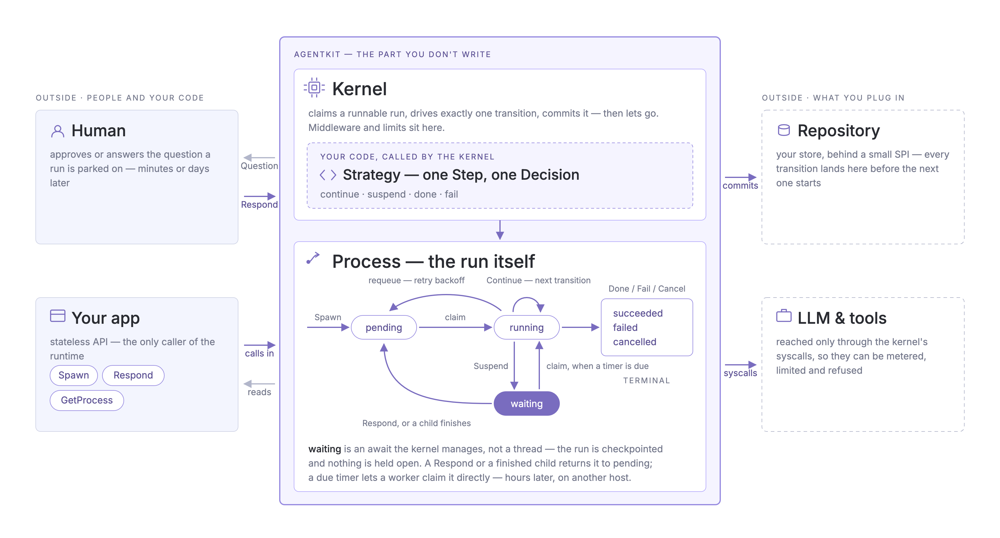

# agentkit

A durable runtime for long-running LLM agents in Go.

An agent loop is easy to write and hard to *operate*. The usual one keeps the
whole run — conversation, tool results, "waiting for the user to click approve" —
in the memory of one process, so a deploy, a crash, or a scale-in ends it. There
is nothing to resume, because nothing was ever written down.

`agentkit` stores each run as a durable `Process`. A worker claims it and
executes transitions one at a time, committing each before starting the next,
then releases the run; any worker can continue from the last committed
transition — after a crash, a deploy, or a wait that lasted a day. It is built on [gollem](https://github.com/gollem-dev/gollem) for
the LLM client and tool abstractions, and stays deliberately small: the kernel is
a state machine, a lease, and a wait queue — nothing more.

## Is agentkit for you?

Use it when:

- a run must survive a deploy, a crash, or a scale-in;
- a run may wait minutes or days for a human, a timer, or a child process;
- several worker processes, on several hosts, execute from the same store;
- token and tool usage must be measured and bounded per run.

You probably do not need it when the agent finishes inside one request and losing
an in-progress run is acceptable. An in-memory loop is less machinery, and it is
the right answer until a run outlives the process holding it.

## Try it

The bundled quickstart needs no credentials: with no model configured, the LLM is
a stub replaying a script.

```bash
git clone https://github.com/gollem-dev/agentkit
cd agentkit/examples
go run ./quickstart
```

```
model:   scripted stub (set GEMINI_PROJECT_ID and GEMINI_LOCATION to run against Vertex AI)
spawned: 01a050c2-c09b-7918-bca4-1e468f5c1fdf
status:  succeeded
answer:  A durable agent runtime checkpoints an agent after every step, so a crash resumes the work instead of restarting it. The state lives in a store rather than in one process's memory, so any worker can pick it up.
metrics: llm_calls=1 input_tokens=64 output_tokens=16
```

It registers an agent, writes a `Process`, runs a worker until that `Process`
finishes, and prints the persisted result with its usage. Six more programs in
[examples/](./examples/) cover tools, human input, crash recovery, parallel
children, middleware and tracing.

## What it provides

- **Crash recovery** — every transition is committed to your store before the
  next one starts, and any worker resumes from the last checkpoint.
- **Durable waits** — a run parks on a question, a timer, or a set of children
  without holding a goroutine, a connection, or a worker.
- **Multi-worker execution** — workers claim persisted runs under a lease, and a
  worker that lost its lease cannot commit, so any number of workers on any
  number of hosts can share one store.
- **Child processes** — a strategy spawns children and waits for their results;
  the children and the parent's new state commit in one atomic write.
- **Usage metering and limits** — token, tool, step and spawn usage accumulates
  on the `Process`, and a strategy's `Limit` decides when a run has had enough —
  or tells the agent the budget is nearly gone and lets it finish on its own terms.
- **Middleware** — one registration wraps every agent's transitions and effects:
  audit, tracing, redaction, retry, tool policy.

## How it works

<p align="center">
  
</p>

| Term | What it is |
|---|---|
| **Process** | one agent run — its state, status, metrics and lease, all in the store |
| **Strategy** | your code: what one transition does |
| **Kernel** | creates and reads Processes, and runs the workers that execute them |
| **Repository** | the storage behind all of it: state, awaits, events, leases |

A worker does the same five things on every transition:

1. **Claim** a `pending` Process — or a `waiting` one whose timer is due.
2. **Decode** the state the previous transition committed.
3. **Run one `Step`.** It reaches the model, the tools and its children through
   `Syscalls` (`Generate`, `CallTool`, `SpawnChild`, `Await`, `Emit`, `Metrics`,
   `Now`), which is where metering and limits are applied.
4. **Commit** the new state, the decision, emitted events, declared awaits and
   spawned children in a single atomic write.
5. **Continue, suspend, succeed or fail.** A `Continue` runs the next transition
   under the same claim, up to `WithMaxStepsPerClaim` of them (16 by default);
   then the run goes back to `pending` for any worker to pick up.

A `Strategy[S, I, O]` names the three types that cross that boundary:

- `S` — the state persisted after each transition;
- `I` — the typed input `Spawn` accepts;
- `O` — the output persisted when the run succeeds.

Because a `Step` is the unit that gets checkpointed, "how much work per `Step`"
is the main design decision you make. Serialization stays yours: the kernel
stores the bytes your `EncodeState` and `EncodeOutput` produce, and never looks
inside them. Concepts in full: [docs/concepts.md](./docs/concepts.md). Writing
your own strategy: [docs/writing-strategies.md](./docs/writing-strategies.md).

## Execution guarantees

Durability is not exactly-once. An LLM is non-deterministic, so `agentkit`
refuses to pretend replay is.

**Guaranteed**

- a committed transition is never lost;
- one transition commits atomically — state, awaits, events, spawned children
  and metrics land in a single write, all of it or none.

That is the whole list.

**At-least-once, with a non-deterministic replay**

- a transition that crashes before committing is re-run from the last committed
  state;
- the LLM and tool calls it already made may run again (an LLM re-charge is
  accepted), and the re-run may take a different path;
- once a lease expires, the run can be claimed again while the original worker
  is still alive, so two workers may execute the same transition. Only one of
  them can commit: a fresh `LeaseToken` per claim and a `Rev` compare-and-set
  fence out the worker that lost its lease.

**Your responsibility**

- a side-effecting tool must be **idempotent**;
- authorization is enforced inside the tool, never by asking a human first;
- a `Repository` you implement must satisfy the contract the kernel relies on.

There is no effect journal, no operation label, and no deterministic clock — a
worker just re-executes `Step` from the checkpoint. For exactly-once effects,
commit the decision to state first and execute it in the next transition. Read
[docs/execution-model.md](./docs/execution-model.md) before writing a tool that
touches the outside world; it is short, and it is the part people get wrong.

## Minimal integration

Every agentkit application has the same four parts: **register → construct →
spawn → serve.**

```bash
go get github.com/gollem-dev/agentkit
```

```go
package main

import (
	"context"
	"encoding/json"
	"fmt"
	"log"
	"os"
	"time"

	"github.com/gollem-dev/agentkit"
	"github.com/gollem-dev/agentkit/repository/memory"
	"github.com/gollem-dev/agentkit/strategy/simple"
	"github.com/gollem-dev/gollem/llm/claude"
)

func main() {
	ctx := context.Background()

	client, err := claude.New(ctx, os.Getenv("ANTHROPIC_API_KEY")) // any gollem LLM client
	if err != nil {
		log.Fatal(err)
	}

	// 1. Register. The typed handle it returns is the only way to spawn this
	//    agent, so the input type is checked at compile time.
	reg := agentkit.NewRegistry()
	assistant, err := simple.Register(reg, "assistant", 1)
	if err != nil {
		log.Fatal(err)
	}

	// 2. Construct the kernel: repository, default model, registry. memory.New()
	//    keeps runs in this process — see "Persistence" below for the rest.
	kernel, err := agentkit.New(memory.New(), client, reg)
	if err != nil {
		log.Fatal(err)
	}

	// 3. Spawn. This writes a pending Process and returns its id; nothing has
	//    executed yet.
	pid, err := assistant.Spawn(ctx, kernel, simple.Input{Prompt: "Summarize the news"})
	if err != nil {
		log.Fatal(err)
	}

	// 4. Serve. A deployment runs this in its own process, and in as many of them
	//    as it likes. Here it runs in the background just long enough to finish
	//    this one Process.
	serveCtx, stop := context.WithCancel(ctx)
	defer stop()
	go func() {
		if err := kernel.Serve(serveCtx); err != nil {
			log.Print(err)
		}
	}()

	for {
		proc, err := kernel.GetProcess(ctx, pid)
		if err != nil {
			log.Fatal(err)
		}
		if !proc.Status.Terminal() {
			time.Sleep(100 * time.Millisecond)
			continue
		}
		if proc.Status != agentkit.ProcessSucceeded {
			log.Fatalf("run %s: %+v", proc.Status, proc.Failure)
		}

		var out simple.Output // the strategy owns this format; the kernel stored bytes
		if err := json.Unmarshal(proc.Output, &out); err != nil {
			log.Fatal(err)
		}
		fmt.Println(out.Texts)
		return
	}
}
```

```bash
ANTHROPIC_API_KEY=... go run .
```

This program prints the answer and exits. A real deployment keeps the same four
parts but stops running them in one process: `Serve` moves into its own worker
deployment, and the polling loop becomes whatever your application already uses
to report on a job.

## Running behind an HTTP API

Agents are slower than a request, so keep the HTTP tier stateless. It only
creates and reads persisted Processes; workers execute them separately, through
the same `Repository`.

```
HTTP API (stateless)                    Worker (separate deployment)
  POST /jobs      -> Agent.Spawn          Kernel.Serve
  GET  /jobs/{id} -> Kernel.GetProcess
```

`Spawn` runs the strategy's `Init` and writes a `pending` row, then returns its
id: no request is held open while the agent runs, and nothing has executed yet.
`GetProcess` can be answered by any replica, because the state is in the
`Repository` rather than in the replica that accepted the `POST`. Pass
`agentkit.WithIdempotencyKey(...)` on `Spawn` so a retried `POST` does not start
a second run.

Working code: [examples/durable-worker](./examples/durable-worker) submits and
executes in separate processes, and resumes a run whose worker was killed
mid-transition.

## Waiting for a human

This is the case a plain loop handles worst. The strategy suspends on a question
instead of blocking:

```go
if !st.Confirmed {
	return st, agentkit.Suspend(agentkit.Question("confirm", []byte("run X? (yes/no)"))), nil
}
```

The `Process` is now `waiting` and consumes nothing — no goroutine, no
connection, no worker. Any instance of your application can deliver the answer,
whenever it arrives:

```go
awaits, _ := kernel.ListAwaits(ctx, pid)          // what is this run waiting for?
err := kernel.Respond(ctx, pid, "confirm", []byte("yes"), agentkit.WithRespondedBy("alice"))
```

`Respond` commits the answer and returns the `Process` to `pending`; the next
worker to claim it re-enters `Step` with `Confirmed` set. The human may take an
hour, and the process that asked may be long gone.

> **This is confirmation, not enforcement.** A strategy that is buggy — or steered
> by a prompt injection — can call a tool without ever asking. A hard allow/deny
> gate belongs *inside the tool*: see [docs/tools.md](./docs/tools.md) and
> [ADR-0008](docs/adr/0008-three-await-kinds-confirmation-is-a-question.md).

## Bundled strategies

- **[`strategy/simple`](./strategy/simple)** — an ordinary tool-calling loop:
  generate, run the tool calls it asked for, feed the results back, repeat until
  the model answers. One `Generate` per transition. Start here unless a run has
  to divide its work into independent parts.
- **[`strategy/planexec`](./strategy/planexec)** — plan, run the tasks as parallel
  child processes, wait for them, replan, finalize. Use it when one run must
  decompose the work and outlive the wait for its parts.

Details in [docs/bundled-strategies.md](./docs/bundled-strategies.md).

## Persistence

| Repository | Intended use |
|---|---|
| [`repository/memory`](./repository/memory) | tests, development, one-shot runs |
| [`repository/filesystem`](./repository/filesystem) | one local process that must survive a restart |

Neither runs on more than one host. A deployment with several workers supplies
its own `Repository`: a small SPI over your store, which the application itself
never calls. It needs no transaction mechanism — only an atomic `Apply` and
conditional writes.

Verify that implementation with **repository/repotest**, which is the contract as
a runnable test suite:

```go
func TestMyRepo(t *testing.T) {
	repotest.Run(t, func(t *testing.T) agentkit.Repository { return mystore.New() })
}
```

What it checks — atomic apply, `Rev` compare-and-set, read-only guards,
uniqueness, claiming and lease tokens, event order, deep copies, field
round-trips — is spelled out in [docs/persistence.md](./docs/persistence.md).

## Middleware

One registration on the `Kernel` wraps every agent at six points (`Claim`,
`Init`, `Step`, `Generate`, `CallTool`, `SpawnChild`). That makes it the place
for a concern that spans every agent: tracing and metrics, audit logging,
redaction, retry, tool policy. A middleware can also refuse a call by returning
without calling `next`.

Two things to know before relying on it. A middleware runs again whenever a
transition is replayed, and agentkit persists nothing it records — an audit that
must be durable *before* the action belongs inside the tool's `Run`. And refusing
a call is not an authorization gate: it is a chokepoint for calls made through
`Syscalls.CallTool`, while a strategy holding a `gollem.Tool` value can call
`Run` on it directly.

Middleware points, typed access to a request's payload, and tracing recipes:
[docs/observability.md](./docs/observability.md). Why this replaced the
observation-only hooks:
[ADR-0012](docs/adr/0012-kernel-hooks-are-composable-middleware.md).

## Where to go next

- **Run your first agent** — [docs/getting-started.md](./docs/getting-started.md)
- **Understand Process, Strategy, Kernel and Await** — [docs/concepts.md](./docs/concepts.md)
- **Write your own strategy** — [docs/writing-strategies.md](./docs/writing-strategies.md)
- **Give an agent tools that survive a replay** — [docs/tools.md](./docs/tools.md)
- **Keep runs in your own store** — [docs/persistence.md](./docs/persistence.md)
- **Add tracing, audit and limits** — [docs/observability.md](./docs/observability.md)
- **Know exactly what replay does and does not promise** — [docs/execution-model.md](./docs/execution-model.md)
- **See it running** — [examples/](./examples/), seven programs, one per idea
- **Ask why it is built this way** — [docs/adr/](./docs/adr/), and
  [docs/design/](./docs/design/) for how the pieces fit

## Requirements

- Go 1.26+
- `github.com/gollem-dev/gollem`

## License

See [LICENSE](./LICENSE).
