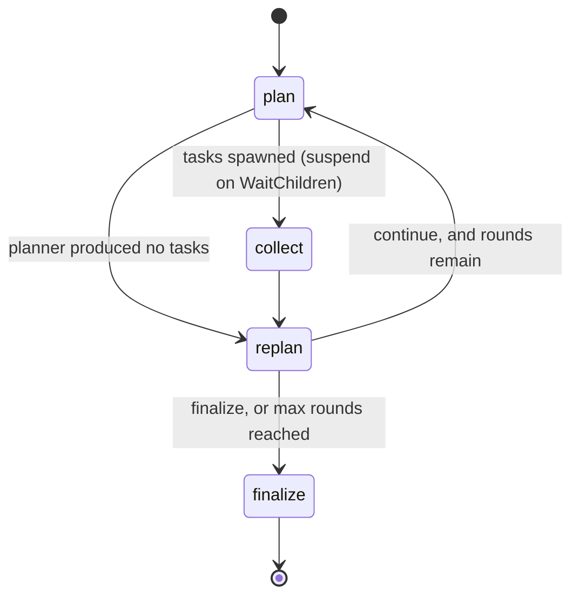

# Bundled strategies

Two general-purpose strategies ship with agentkit. Both encode their state and
output as JSON — that is their own contract, not a kernel rule
([ADR-0007](adr/0007-kernel-neutral-to-serialization.md)).

## strategy/simple

The classic LLM loop: generate, run any tool calls, feed the results back,
repeat until the model answers without calling a tool.

```go
assistant, err := simple.Register(reg, "assistant", 1,
    simple.WithSystemPrompt("You are a helpful assistant."),
    simple.WithRole(myRole),
    simple.WithMaxIterations(16),
)

pid, err := assistant.Spawn(ctx, kernel, simple.Input{Prompt: "Summarize the news"})
```

**Input** is a single `Prompt`; an empty one is rejected by `Init`.
**Output** is `{"texts": [...]}`.

Each transition is one of two phases:

| Phase | Generate calls | What it does |
|---|---|---|
| generate | 1 | prompt or tool results in, response out |
| tools | 0 | runs the pending tool calls, buffers the results |

So a round of "model asks for a tool, tool runs, model sees the result" spans
two transitions, with a checkpoint between them. Exceeding
`WithMaxIterations` (default 32) finishes the process as `failed` with
`FailureStrategyError`.

`simple` never suspends — it declares no awaits and never asks a human. If you
need confirmation, write your own strategy or wrap the tool.

## strategy/planexec

Plan, run the tasks as child processes in parallel, replan, then summarize.

```go
// The task agent can be any registered agent.
worker, err := simple.Register(reg, "worker", 1)

coordinator, err := planexec.Register(reg, "coordinator", 1,
    worker,
    func(spec planexec.TaskSpec) (simple.Input, error) {
        return simple.Input{Prompt: spec.Prompt}, nil
    },
    planexec.WithMaxRounds(3),
    planexec.WithMaxParallelTasks(5),
)
```

`Register` is generic over the task agent's input type. `makeInput` adapts each
planned `TaskSpec` into that type, so the planner and the task agent never need
to know about each other.

**Input** is a single `Prompt`. **Output** is
`{"summary": [...], "tasks": [{title, status, process_id, output}]}`, where each
task's `output` is the child's own output bytes, verbatim — interpreting it is
your job, since you chose the task agent.

### The phases



| Phase | Generate calls | Notes |
|---|---|---|
| plan | 1, or 2 | spawns a child per task, then suspends on `WaitChildren` |
| collect | 0 | folds child results into accumulated state |
| replan | 1 | the planner chooses `continue` or `finalize` |
| finalize | 1 | the summarizer writes the answer |

Two behaviours worth knowing:

- **Plan JSON that fails to parse gets one correction attempt** inside the same
  transition — the only place either bundled strategy makes two `Generate` calls
  in one transition. If the correction also fails to parse, the process fails
  with `FailureStrategyError`.
- **A replan decision that fails to parse defaults to `finalize`.** Spawning
  another round on a malformed decision is the unsafe choice; finalizing is
  terminal and keeps a flaky planner from hanging the process forever.

### Model roles

```go
var (
    RolePlanner    // planning and replanning
    RoleSummarizer // the final summary
)
```

Bind them if you want different models per role; anything unbound falls back to
the default model given to `New`:

```go
kernel, err := agentkit.New(repo, fastModel, reg,
    agentkit.WithModelRole(planexec.RolePlanner, strongModel),
)
```

The planner keeps its conversation history across rounds. The summarizer does
not — it sees the accumulated task results, not the planning dialogue.

## Choosing between them

| | `simple` | `planexec` |
|---|---|---|
| Work shape | sequential tool use | independent parallel subtasks |
| Child processes | none | one per task |
| Suspends | never | on `WaitChildren` each round |
| Model roles | one | planner + summarizer |

Neither asks for human confirmation. If you need that, or a domain-specific
control flow, write your own — see
[writing-strategies.md](writing-strategies.md). They are also worth reading as
worked examples: both are small, and both demonstrate the phase-field idiom that
keeps one `Generate` per transition.
