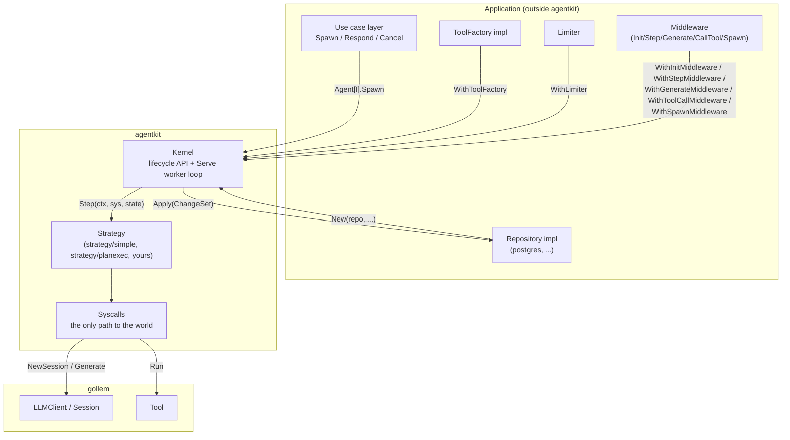
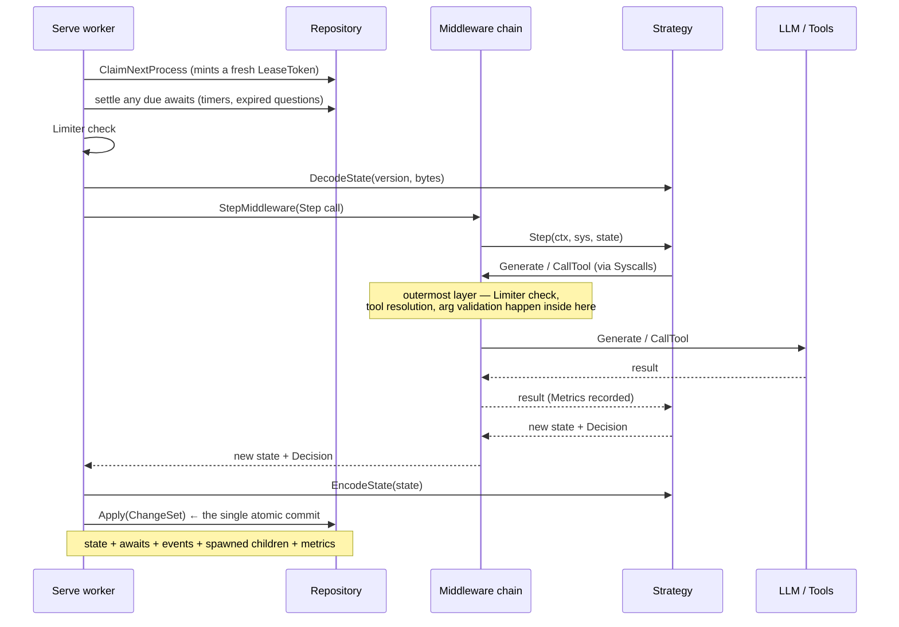

# Architecture

## The shape of the system

agentkit is a kernel that drives user-written state machines and persists them
after every transition. Everything else is an extension point.



The kernel sits in the middle and owns exactly two things: **the state machine
of a `Process`, and the atomicity of one transition.** It is deliberately
ignorant of everything else — data formats (ADR-0007), tenancy (ADR-0011),
transactions (ADR-0004), and cost (ADR-0010).

## The extension points

| Port | Form | Who implements it | Mandatory |
|---|---|---|---|
| `Repository` | interface | the application | yes |
| `Strategy[S, I, O]` | interface | the agent author | yes (or use a bundled one) |
| `ToolFactory` | function type | the application | no |
| `Limiter` | function type | the application | no |
| Middleware (`Init`/`Step`/`Generate`/`CallTool`/`Spawn`) | `next`-chain, repeatable | the application | no |

`Repository` and `Strategy` are interfaces because both have several related
operations that must move together. `ToolFactory` and `Limiter` are function
types because each is a single decision best written as a closure — a stateful
implementation passes a method value. Middleware is a fifth kind: unlike the
other four it is chain-composable — each `WithXMiddleware` call is repeatable,
and registrations nest around one another instead of replacing a single slot
([ADR-0012](../adr/0012-kernel-hooks-are-composable-middleware.md)).

## Package layout

One flat root package plus opt-in subpackages (ADR-0002):

```
agentkit/                  kernel, all port definitions, all shared types
  strategy/simple/         LLM loop: generate -> run tools -> feed back -> repeat
  strategy/planexec/       plan -> children in parallel -> replan -> finalize
  repository/memory/       reference impl: in-process
  repository/filesystem/   reference impl: one snapshot file, single process
  repository/repotest/     the Repository contract, executable
  repository/internal/     shared state machine behind memory and filesystem
```

Within the root package, file names carry the structure that packages would
otherwise: `process.go`, `await.go`, `decision.go`, `event.go`, `metric.go` hold
the model; `kernel.go` the lifecycle API; `worker.go` the transition machinery;
`syscalls.go` the effect gateway; `strategy.go`, `repository.go`, `tool.go`,
`middleware.go` the ports.

## One transition, end to end

A transition is the unit of progress and the unit of durability. Its entire
effect on the world lands in a single `Repository.Apply`.



`StepMiddleware` wraps the `Step` call shown above; it does not see this
`Apply` — the commit happens after the handler returns, outside the chain
([observability.md](../observability.md)).

Everything the transition produced rides that one `Apply`:

- the updated process row (state bytes, state version, sequence, metrics,
  status, wake time, lease),
- any child processes the strategy spawned (ADR-0009),
- any events it emitted, plus a `await.created` event for each new question,
- any await rows it declared,
- read-set `Guards` for `WaitChildren`.

If the `Apply` does not happen, none of it happened. If it does, all of it did.

## What flows through Syscalls, and why that matters

A `Strategy` receives no `Repository`, no LLM client, and no tool list except
through `Syscalls`. That single gateway is what makes metering universal: every
`Generate`, `CallTool` and `SpawnChild` runs a `Limiter` check before and
accumulates `Metrics` after, with no path around it (ADR-0010).

`Syscalls` is assembled fresh per claim and holds the transition's buffers —
pending children, pending events, accumulated metrics. Those buffers are what
`buildCommit` folds into the change set. This is why a strategy's side effects
on the *framework* are atomic while its side effects on the *world* are not
(ADR-0003): the former are buffered, the latter go straight out.

## Where the kernel deliberately stops

Each of these is a decision with an ADR behind it, and each pushes a
responsibility outward on purpose:

- **No effect journal.** Transitions replay at least once; idempotency belongs
  to tool authors (ADR-0003).
- **No approval gate.** Confirmation is a strategy-level question; enforcement
  belongs inside tools (ADR-0008).
- **No serialization.** Bytes in, bytes out (ADR-0007).
- **No tenancy.** Scope propagates through metadata or context (ADR-0011).
- **No cost model.** Tokens are counted; money is the caller's arithmetic
  (ADR-0010).
- **No event delivery.** Events are written durably and in order; shipping them
  is the caller's (ADR-0012).

Before adding anything to the kernel, check it against this list. The pattern is
consistent: agentkit provides mechanism where it can be correct, and declines
where correctness would depend on knowledge it does not have.
