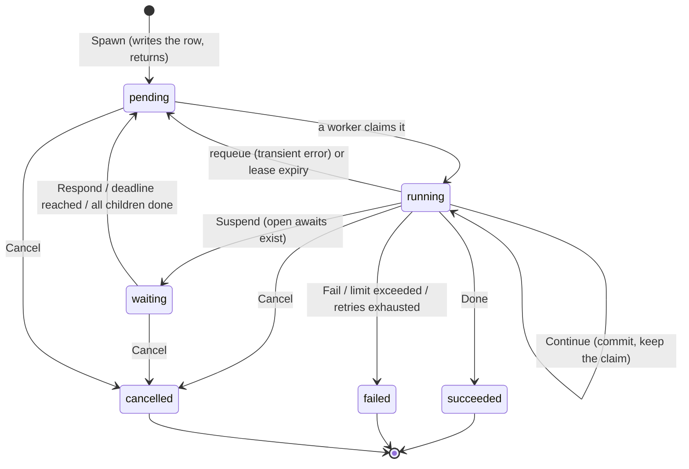
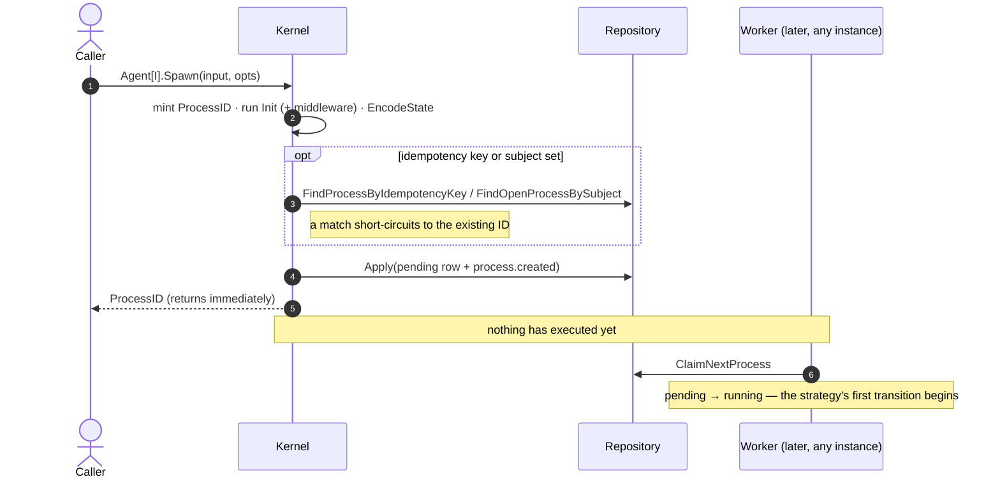
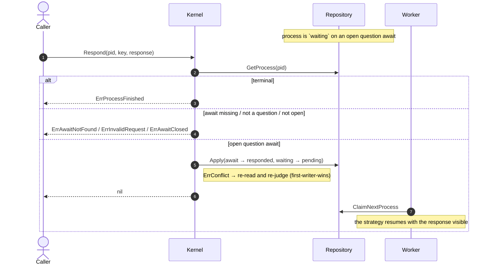
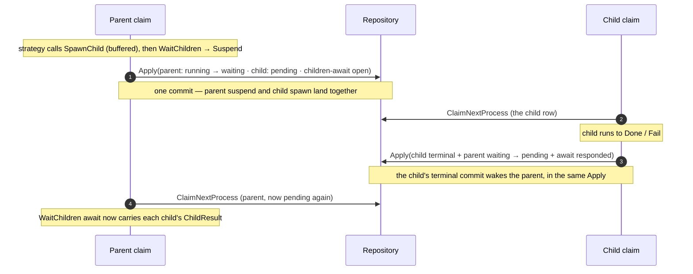

# Process lifecycle

## The state machine

A `Process` has six statuses, three of them terminal.



Two properties are worth stating explicitly:

- **`pending` is the parking state.** A process becomes claimable by returning to
  `pending`, whether it was answered, requeued after an error, or is waking on a
  deadline. There is only one way in for a worker: `ClaimNextProcess`.
- **`limit_exceeded` is not a status.** It is `failed` carrying
  `FailureLimitExceeded`, alongside `FailureStrategyError` and
  `FailureRetryExhausted` (ADR-0010).

`Spawn` is asynchronous. It mints the `ProcessID`, runs `Init` through its
middleware chain, encodes the initial state, and inserts a `pending` row.
Nothing executes until a worker claims it — which is why the verb is *spawn*
and not *start* (ADR-0013). `SpawnChild` follows the same path
([observability.md](../observability.md)).

## Major cases, in sequence

The state machine above says *which* transitions exist. These diagrams say *who*
drives each one and *when* — the lifecycle-level view, one actor per column. The
inner mechanics of a single transition (decode → `Step` → commit) are in
[architecture.md](architecture.md); here the smallest unit is a whole `Apply`.

Two columns recur: **Caller** is application code holding the `Kernel` (a use
case, an HTTP handler), and **Worker** is a `Serve` claim loop — possibly on a
different instance, possibly minutes later. The gap between them is the whole
point: every arrow into the `Repository` is durable, and nothing bridges Caller
and Worker except rows.

### Spawn — launch, then walk away

`Spawn` returns a `ProcessID` the instant the `pending` row lands. Execution is a
separate event on a separate instance.



`Init` runs *before* the idempotency lookup, so an idempotent `Spawn` that ends
up returning an existing process still pays for `Init`; the freshly minted id is
discarded. A uniqueness conflict on `Apply` (a concurrent `Spawn` won the race)
is resolved by re-finding and returning the winner's id.

### Respond — deliver an answer to a waiting process

`Respond` is how an answer to a question await (a human's yes/no, an external
callback) re-queues a `waiting` process. It moves the row to `pending`; it does
**not** run the strategy — a worker does that on its next claim.



The same `pending` landing pad is reached three ways — a `Respond`, a deadline
firing, or the last child finishing. A worker cannot tell them apart, and does
not need to: it just claims the row and re-runs `Step`.

### Cancel — request now, finalize wherever the process lives

`Cancel` never terminates a *running* process directly, because that worker owns
the lease. It splits on whether anyone is currently executing the row.

```mermaid
sequenceDiagram
  autonumber
  actor App as Caller
  participant K as Kernel
  participant R as Repository
  participant W as Worker

  App->>K: Cancel(pid, reason)
  K->>R: GetProcess(pid)
  alt terminal
    K-->>App: ErrProcessFinished
  else running (a worker holds the lease)
    K->>R: Apply(cancel_requested = true)
    K-->>App: nil
    Note over W: at its next re-read, the owning worker sees the flag
    W->>R: finalize as cancelled (fenced by its own lease)
  else pending / waiting (unclaimed)
    K->>R: finalize as cancelled now (external fence)
    Note right of K: ErrConflict — it was just claimed — → loop re-reads;<br/>next pass takes the "running" branch and sets the flag
    K-->>App: nil
  end
```

Either branch reaches termination through the same commit path, so awaits are
closed and a waiting parent is woken exactly as with any other ending. The
detail of why an external caller propagates `ErrConflict` instead of retrying
silently is in [Cancellation](#cancellation) below.

### Child processes — spawn, wait, and be woken atomically

The case that most needs a picture: a parent spawns children, suspends on
`WaitChildren`, and is woken by the *last child's own terminal commit* — never by
a separate "notify the parent" write (ADR-0009).



If every child is *already* terminal when the parent declares the wait, there is
no one left to do the waking — so the await is written already `responded` and
the parent stays `running` and continues straight on (the elision in
[The four decisions](#the-four-decisions)).

## What a claim does

`Serve` runs one or more loops that poll `ClaimNextProcess`. A process is
claimable when it is `pending`, or `waiting` with a `WakeAt` in the past, or
`running` with an expired lease. Every claim mints a fresh `LeaseToken` — the
fence identity for that claim.

Wakeup is polling only. A `LISTEN`/`NOTIFY`-style push is a store-specific
optimization; putting it in the `Repository` contract would tax every
implementation. It can be added later as an optional interface without breaking
anyone.

A claim is not one transition. Having paid for the claim, the worker runs a
bounded run of transitions, re-reading the process each time and stopping when
the process suspends, terminates, or the budget runs out (at which point it
returns the process to `pending` for someone else). Before the first transition
it settles any due awaits: a timer past its deadline becomes `responded` with
`Fired` set, a question past its deadline becomes `expired`.

**Timers therefore fire on the next claim, not on a scheduler.** The `WakeAt`
field is what makes that claim happen; precision is bounded by the poll interval.

A claim ends in one of four ways, and three of them clear the lease as they move
the process off `running`:

| Ending | Result |
|---|---|
| `Suspend` | `waiting`, lease cleared |
| `Done` / `Fail` | terminal, lease cleared |
| step budget spent | `release` returns it to `pending`, lease cleared |
| lease lost, or an error | abandon, or `requeue` to `pending` with backoff |

That table is why a `running` row with a lapsed lease means something specific:
no orderly ending leaves one behind, so encountering one means the previous
claim vanished mid-transition.

## The lease is not a timeout

A lease does not limit how long a transition may take. Nothing is cancelled when
it expires, and no error is raised. It answers one question only:

> from when may another worker assume this one is dead?

A worker whose lease lapses keeps running. It discovers it lost only at its next
fence check, or when its `Apply` conflicts and the stored `LeaseToken` is no
longer its own — and then it discards its work
([consistency-model.md](consistency-model.md)). So a lease that is too short does
not produce a failure; it produces **a second execution of the same transition**,
which is the at-least-once model showing through
([execution-model.md](../execution-model.md)).

**The lease is renewed on every commit**, not once per claim. A claim runs up to
`WithMaxStepsPerClaim` transitions, and each committed one pushes the expiry out
again. The window a lease has to cover is therefore *one transition*, not the
whole run.

**There is no heartbeat inside a transition.** Nothing extends the lease while
`Step` is executing, so a single `Generate` that outlives the lease will be
reclaimed underneath the worker running it. Size the lease against the slowest
single transition — one `Generate` plus that round's tool calls — with margin.

`LeaseUntil` is the expiry; `LeaseToken` is the fence identity and the thing
every correctness check compares. `LeaseOwner` is diagnostic only and must never
be used to fence.

## Anatomy of one transition

```
re-read the process
  ├─ lease token changed?  → abandon, another worker owns it now
  └─ cancel requested?     → finalize as cancelled
Limiter check              → failed(limit_exceeded) if it says stop
DecodeState(version, bytes)
Step(ctx, sys, state)      → new state, Decision
EncodeState(state)
build the ChangeSet
Apply
  ├─ ok        → next transition, or suspend, or return
  └─ conflict  → still hold the lease? rebuild and retry : abandon
```

The re-read at the top of every iteration is what makes `Cancel` responsive
mid-run and what detects a lost lease before wasting an LLM call.

### The four decisions

| Decision | Status after commit | What happens next |
|---|---|---|
| `Continue` | `running`, lease renewed | the worker runs the next transition |
| `Suspend` | `waiting`, `WakeAt` = earliest open deadline | the worker releases; a response or deadline re-queues it |
| `Done` | `succeeded`, output stored | terminal; a waiting parent is woken in the same `Apply` |
| `Fail` | `failed` with a code | terminal; same parent wake |

`Suspend` that produces no open await and no `WaitChildren` elision is rejected
as `ErrSuspendWithoutAwait`. Committing it would park the process with nothing
able to wake it — a permanent hang, caught at the boundary instead (ADR-0008).

The one case that looks like a suspend but is not: `WaitChildren` where every
child is already terminal. The await is written as already `responded`, the
process stays `running`, and the claim continues straight into the next
transition. Without this, a fast child that finished before the parent declared
its wait would leave nobody to do the waking (ADR-0009).

## Errors, retries, and termination

Re-execution splits into four kinds by *where* it arises. The first three are
errors the worker saw; the fourth is the worker not being there any more.

**Transition errors** — a failure in `DecodeState`, `Step`, or `EncodeState`,
including a recovered panic from the strategy or its `StepMiddleware` chain.
The process is requeued with an
exponential backoff (doubling, capped at a minute) and an incremented attempt
counter. When attempts exceed the limit, it terminates as `failed` with
`FailureRetryExhausted`. Metrics consumed by the failed attempt are folded in
either way, so a crash loop cannot burn budget invisibly.

**Commit conflicts** — `ErrConflict` from `Apply`. The worker re-reads and asks
one question: *do I still hold the lease?* If the stored `LeaseToken` matches, a
benign racer (a concurrent `Cancel`, a sibling finalize) moved the row, so the
transition is rebuilt against fresh state and retried. If it does not match,
another worker has claimed the process; this worker abandons silently and never
rebases its `Rev`. See [consistency-model.md](consistency-model.md).

**Infrastructure errors** — a `ToolFactory` failure, for example. Requeued
without consuming an attempt, since the fault is not the strategy's.

**Unclean reclaims** — the claim itself vanished. The worker died, or its lease
lapsed while it was still running, and another worker took the row over. Nothing
went through `requeue`, so `StepAttempts` does not move; `ClaimNextProcess`
increments `UncleanReclaims` instead, and the worker refuses to start a
transition once it exceeds `WithMaxUncleanReclaims` (default 3), terminating as
`failed` with `FailureUncleanReclaim`.

The two counters stay apart because they carry different information. An error
says how far the previous attempt got. A vanished claim says nothing at all: the
transition may have completed every effect and died immediately before its
commit, and a lease-expiry reclaim may be running *alongside* a predecessor that
has not noticed yet. That difference is why the bounds are separate knobs — "retry
errors three times, but never re-run after a crash" is a sentence one counter
cannot express ([ADR-0015](../adr/0015-unclean-reclaims-are-counted-and-bounded.md)).

Both are reset by any successful commit, and both are visible to the strategy as
`Syscalls.Attempt()` and to middleware as `EffectContext.Attempt`.

A strategy's own `Fail` is not an error at all. It is a normal decision that
commits a terminal state.

## Termination and its side effects

Terminating is a single `Apply` that carries, together:

- the terminal row (status, output or failure, folded metrics),
- every open await closed as `cancelled`,
- the parent's `WaitChildren` await updated, and the parent flipped from
  `waiting` to `pending` if this was the last child,
- a `process.finished` event.

Bundling the parent wake into the child's own terminal commit is what closes the
crash window between "child finished" and "parent notified" (ADR-0009). The
parent row is included even when the wake is a no-op, so that concurrent sibling
finalizes serialize on the parent's `Rev` rather than each concluding that
someone else will do the waking.

If any read needed to build that change set fails, the whole finalize is
abandoned rather than committed partially. The process stays non-terminal and is
retried after its lease expires — a delayed finalize is recoverable, a lost
wakeup is not.

A registered completion handler (`WithOnFinish`) runs immediately after that
`Apply` succeeds, synchronously, on whichever instance committed. Everything
above is inside the commit; the handler is outside it, and that asymmetry is the
whole of its guarantee:

- It cannot fire twice. Every terminal path funnels through one commit, and a
  worker that loses the CAS race abandons before reaching the call.
- **It can fire zero times.** A crash in the window between the `Apply` and the
  call loses the notification, and nothing retries it — there is no journal to
  retry from (ADR-0003).

That window is the reason follow-up work which must not be lost belongs in a
parent process waiting on `WaitChildren`, where it is part of a committed
transition rather than a call after one ([ADR-0014](../adr/0014-completion-handlers-are-best-effort.md)).

## Cancellation

`Cancel` sets `CancelRequested` on the row rather than terminating directly. A
process not currently claimed is finalized immediately; one mid-transition is
finalized by its own worker at the next re-read. Either way the terminal commit
goes through the same path, so awaits are closed and the parent is woken exactly
as with any other termination.

An external caller's commit conflict is propagated as `ErrConflict` rather than
being silently retried, so the caller re-reads and re-decides — unlike a worker,
an external caller has no lease to prove it should win.
