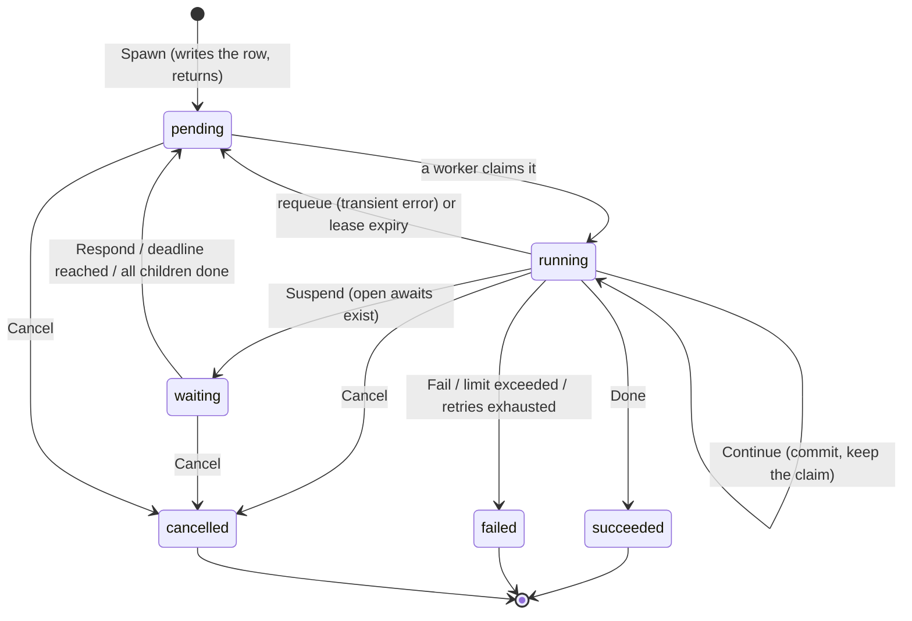

# Process lifecycle

## The state machine

A `Process` has six statuses, three of them terminal.



Two properties are worth stating explicitly:

- **`pending` is the parking state.** A process becomes claimable by returning to
  `pending`, whether it was answered, requeued after an error, or is waking on a
  deadline. There is only one way in for a worker: `ClaimNextProcess`.
- **`limit_exceeded` is not a status.** It is `failed` carrying
  `FailureLimitExceeded`, alongside `FailureStrategyError` and
  `FailureRetryExhausted` (ADR-0010).

`Spawn` is asynchronous. It runs `Init` purely, encodes the initial state, and
inserts a `pending` row. Nothing executes until a worker claims it — which is
why the verb is *spawn* and not *start* (ADR-0013).

## What a claim does

`Serve` runs one or more loops that poll `ClaimNextProcess`. A process is
claimable when it is `pending`, or `waiting` with a `WakeAt` in the past, or
`running` with an expired lease. Every claim mints a fresh `LeaseToken` — the
fence identity for that claim.

Wakeup is polling only. A `LISTEN`/`NOTIFY`-style push is a store-specific
optimization; putting it in the `Repository` contract would tax every
implementation. It can be added later as an optional interface without breaking
anyone.

A claim is not one transition. Having paid for the claim, the worker runs a
bounded run of transitions, re-reading the process each time and stopping when
the process suspends, terminates, or the budget runs out (at which point it
returns the process to `pending` for someone else). Before the first transition
it settles any due awaits: a timer past its deadline becomes `responded` with
`Fired` set, a question past its deadline becomes `expired`.

**Timers therefore fire on the next claim, not on a scheduler.** The `WakeAt`
field is what makes that claim happen; precision is bounded by the poll interval.

## Anatomy of one transition

```
re-read the process
  ├─ lease token changed?  → abandon, another worker owns it now
  └─ cancel requested?     → finalize as cancelled
Limiter check              → failed(limit_exceeded) if it says stop
DecodeState(version, bytes)
Step(ctx, sys, state)      → new state, Decision
EncodeState(state)
build the ChangeSet
Apply
  ├─ ok        → next transition, or suspend, or return
  └─ conflict  → still hold the lease? rebuild and retry : abandon
```

The re-read at the top of every iteration is what makes `Cancel` responsive
mid-run and what detects a lost lease before wasting an LLM call.

### The four decisions

| Decision | Status after commit | What happens next |
|---|---|---|
| `Continue` | `running`, lease renewed | the worker runs the next transition |
| `Suspend` | `waiting`, `WakeAt` = earliest open deadline | the worker releases; a response or deadline re-queues it |
| `Done` | `succeeded`, output stored | terminal; a waiting parent is woken in the same `Apply` |
| `Fail` | `failed` with a code | terminal; same parent wake |

`Suspend` that produces no open await and no `WaitChildren` elision is rejected
as `ErrSuspendWithoutAwait`. Committing it would park the process with nothing
able to wake it — a permanent hang, caught at the boundary instead (ADR-0008).

The one case that looks like a suspend but is not: `WaitChildren` where every
child is already terminal. The await is written as already `responded`, the
process stays `running`, and the claim continues straight into the next
transition. Without this, a fast child that finished before the parent declared
its wait would leave nobody to do the waking (ADR-0009).

## Errors, retries, and termination

Errors split into three kinds by *where* they arise.

**Transition errors** — a failure in `DecodeState`, `Step`, or `EncodeState`,
including a recovered strategy panic. The process is requeued with an
exponential backoff (doubling, capped at a minute) and an incremented attempt
counter. When attempts exceed the limit, it terminates as `failed` with
`FailureRetryExhausted`. Metrics consumed by the failed attempt are folded in
either way, so a crash loop cannot burn budget invisibly.

**Commit conflicts** — `ErrConflict` from `Apply`. The worker re-reads and asks
one question: *do I still hold the lease?* If the stored `LeaseToken` matches, a
benign racer (a concurrent `Cancel`, a sibling finalize) moved the row, so the
transition is rebuilt against fresh state and retried. If it does not match,
another worker has claimed the process; this worker abandons silently and never
rebases its `Rev`. See [consistency-model.md](consistency-model.md).

**Infrastructure errors** — a `ToolFactory` failure, for example. Requeued
without consuming an attempt, since the fault is not the strategy's.

A strategy's own `Fail` is not an error at all. It is a normal decision that
commits a terminal state.

## Termination and its side effects

Terminating is a single `Apply` that carries, together:

- the terminal row (status, output or failure, folded metrics),
- every open await closed as `cancelled`,
- the parent's `WaitChildren` await updated, and the parent flipped from
  `waiting` to `pending` if this was the last child,
- a `process.finished` event.

Bundling the parent wake into the child's own terminal commit is what closes the
crash window between "child finished" and "parent notified" (ADR-0009). The
parent row is included even when the wake is a no-op, so that concurrent sibling
finalizes serialize on the parent's `Rev` rather than each concluding that
someone else will do the waking.

If any read needed to build that change set fails, the whole finalize is
abandoned rather than committed partially. The process stays non-terminal and is
retried after its lease expires — a delayed finalize is recoverable, a lost
wakeup is not.

## Cancellation

`Cancel` sets `CancelRequested` on the row rather than terminating directly. A
process not currently claimed is finalized immediately; one mid-transition is
finalized by its own worker at the next re-read. Either way the terminal commit
goes through the same path, so awaits are closed and the parent is woken exactly
as with any other termination.

An external caller's commit conflict is propagated as `ErrConflict` rather than
being silently retried, so the caller re-reads and re-decides — unlike a worker,
an external caller has no lease to prove it should win.
